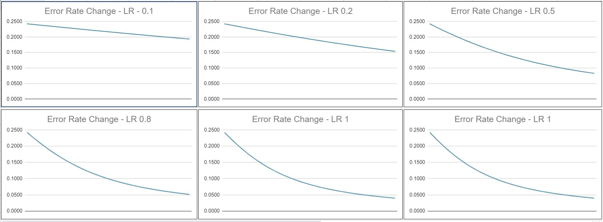

# Assignment 2
### Group Members
Santosh Boina - santoshb183@gmail.com              
Sai Ashok Kumar Reddy - saiashokumareddy@gmail.com                
Jayasankar Raju S - muralis2raj@gmail.com             

Steps taken:
1. We have created a feed forward neural network, with backpropagation  algorithm to adjust the weights based on the error rate obtained in the previous epoch in a way to reduce error rates and make the model reliable.
2. We have created a neural network with 4 layers : 1 input, 1 output , 2 hidden layers
3. We have initialized our neural network with the weights : w1= 0.15, w2 = 0.2, w3=0.25, w4=0.3, w5=04, w6=0.45, w7=0.5, w8=0.55; our input values are i1=0.05 & i2= 0.1; our expected/target values are t1=0.01 & t2=0.99.
4. we have created variables such that:  
    h1=w1*i1 +w2*i2  
    h2= w3*i1 + w4*i2  
    a_h1 = σ(h1)  [Activated, h1]  
    a_h2 = σ(h2) [Activated, h2]  
    o1 = a_h1 * w5 + a_h2* w6  
    o2 = a_h1*w7 + a_h2*w8  
    a_o1 = σ(o1) [Activated, o1]  
    a_o2= σ(o2)  [Activated, o2]  
    E1 = (1/2)* (t1-a_o1)^2  [Error-1]  
    E2 = (1/2)* (t2- a_o2)^2 [Error-2]  
    E_t = E1+E2  [Total Error]  
5.  We then took the partial derivate of ∂E_t w.r.t ∂w5, where we applied chain rule to derive the below:  
    ∂E_t/∂w5 = ∂(E1+E2)/∂w5 = ∂E1/∂w5[ since rate of change of E2 is not effected by w5, E2 is constant, so its partial-derivate is 0] =  
    (∂E1/∂a_01) * (∂a_o1/∂o1)* (∂o1/∂w5)
    plugging in our initial values in step-4, we get the below for  
    ∂E_t/∂w5 =	(a_o1 - t1)*a_o1*(1 - a_o1)*a_h1  
    ∂E_t/∂w6 =	(a_01 - t1)*a_o1*(1 - a_o1)*a_h2  
    ∂E_t/∂w7 =	(a_02 - t2)*a_o2*(1 - a_o2)*a_h1  
    ∂E_t/∂w8 =	(a_02 - t2)*a_o2*(1 - a_o2)*a_h2  

6. The total error w.r.t d_h1 is then normalized the the below, again use the chain rule.  
    ∂E_t/∂a_h1 =	∂(E1+E2)/∂a_h1  
    ∂E1/∂a_h1 =	∂E1/∂a_o1 * ∂a_01/∂o1 * ∂o1/∂a_h1 = (a_o1-t1) * a_o1 *(1-a_o1) * w5  
    ∂E2/∂a_h1 =	∂E2/∂a_o1 * ∂a_01/∂o1 * ∂o1/∂a_h1 = (a_o2-t2) * a_o2 *(1-a_o2) * w7  
7. We then found the partial derivative of E_t w.r.t w1, w2, w3, w4, which again by the use of chain rule and plugging the intialized values in step-4, we derived below:  
    ∂E_t/∂w1 =	∂E_t/∂a_h1 *(a_h1 * (1-a_h1)) * i1		=		((a_o1-t1) * a_o1 *(1-a_o1) * w5 + (a_o2-t2) * a_o2 *(1-a_o2) * w7) *(a_h1 * (1-a_h1)) * i1  
    ∂E_t/∂w2 =	∂E_t/∂a_h1 *(a_h1 * (1-a_h1)) * i2		=		((a_o1-t1) * a_o1 *(1-a_o1) * w5 + (a_o2-t2) * a_o2 *(1-a_o2) * w7) *(a_h1 * (1-a_h1)) * i2  
    ∂E_t/∂w3 =	∂E_t/∂a_h1 *(a_h2 * (1-a_h2)) * i1		=		((a_o1-t1) * a_o1 *(1-a_o1) * w5 + (a_o2-t2) * a_o2 *(1-a_o2) * w7) *(a_h2 * (1-a_h2)) * i1  
    ∂E_t/∂w4 =	∂E_t/∂a_h1 *(a_h2 * (1-a_h2)) * i2		=		((a_o1-t1) * a_o1 *(1-a_o1) * w5 + (a_o2-t2) * a_o2 *(1-a_o2) * w7) *(a_h2 * (1-a_h2)) * i2  
 8. Now for backpropagation to calculate new weights, we used the formula
    W_new = W_old - LR(∂E_t/∂W_old) 
 9. We have applied the above formula for all the weights and applied it for 134 iterations(epochs)
 10. Observations: We just trained a feed forward neural network, with backpropagation alogrithm, and the total error seems be going down as the iterators increased there by imporving the accuracy of our model.
 11. We then plotted a graph and validated the error graph for various learning rates (LR). It is observed that as the LR increases the error is being reduced with in few iterations, but if the LR is lowered it take many iterations for the nueral network to reduce the error.

Learning rate: 0.1 to 1.0

5. What happens to the error graph as learning rate increases?
    Learning rate is helpful in adjusting the weight of the neural network with respect to the loss gradient. At lower values, the travel time towards the downward slope is slower, as the learning rate increases the travel time towards the downward time is faster. The same can be inferred from the above screenshots, ranging from 0.1 to 2.0

